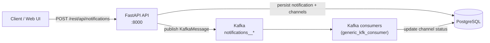
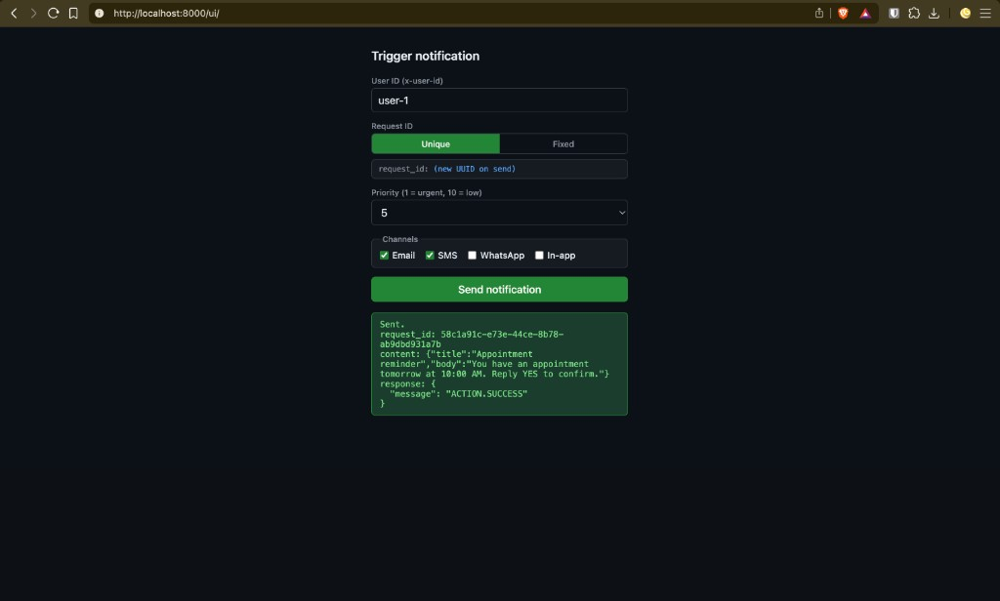

# DeliverX

A distributed notification delivery system built with **FastAPI**, **PostgreSQL**, and **Apache Kafka**. Clients submit multi-channel notification requests over HTTP; the API persists intent and publishes work to Kafka; worker consumers process deliveries asynchronously and update per-channel status in the database.

---

## What it does today

| Capability | Status |
|------------|--------|
| Submit notifications via REST API | ✅ |
| Multi-channel fan-out (email, SMS, WhatsApp, in-app) | ✅ |
| Async delivery via Kafka topics | ✅ |
| PostgreSQL persistence (notification + per-channel rows) | ✅ |
| Idempotency by `request_id` | ✅ |
| Priority on messages (1 = most urgent, 10 = least) | ✅ (Kafka message key) |
| Mock channel providers (latency + random failure) | ✅ |
| Per-channel attempt tracking | ✅ |
| Horizontally scalable Kafka consumers | ✅ (4 consumer containers in Compose) |
| Web UI for manual testing | ✅ (`/ui`) |
| OpenAPI / Swagger docs | ✅ (`/`) |
| Health check | ✅ |
| Transactional outbox | 🔲 Schema exists; publish is direct to Kafka today |
| Dead letter queue | 🔲 Stub only (`DlqProducer`, `move_to_dlq` not wired) |
| Status query API (`GET /notifications/{id}`) | 🔲 |
| Rate limiting (Redis is provisioned in setup) | 🔲 |
| Admin / DLQ replay APIs | 🔲 |
| Metrics (Prometheus, etc.) | 🔲 |

---

## Architecture



**Request flow**

1. Client sends `POST /rest/api/notifications` with a unique `request_id`, channel list, content, priority, and trigger event. Header `x-user-id` identifies the recipient user.
2. **Idempotency** — if `request_id` already exists, the API returns success without creating duplicates.
3. **Persistence** — a `notifications` row is created (`queued`) and one `notification_channels` row per selected channel (`pending`).
4. **Publish** — for each channel, a `KafkaMessage` is sent to `notifications__{channel}` (e.g. `notifications__email`). Priority is used as the Kafka record key.
5. **Consume** — workers in consumer group `notifications__consumer-group` read messages, run mock delivery, and set channel status to `delivered` or `failed`, incrementing `attempt_count` and recording `last_error` on failure.

---

## Tech stack

| Layer | Technology |
|-------|------------|
| API | FastAPI, Uvicorn |
| Database | PostgreSQL 17, SQLAlchemy 2 (async), Alembic |
| Messaging | Apache Kafka 4.3 (`kafka-python` producer, `aiokafka` consumer) |
| Runtime | Python 3.11+, [uv](https://github.com/astral-sh/uv) |
| Containers | Docker Compose |

Infrastructure started by `docker-compose-setup.yml`: PostgreSQL, Kafka, Redis (Redis is not used by application code yet).

---

## Running the project

DeliverX is started with two shell scripts in the repo root. Run them **in order** from the project directory.

### Quick start

```bash
# 1. Infrastructure (Postgres, Kafka, Redis) — detached
./start-setup.sh

# 2. Migrations + API + consumers — foreground (keeps this terminal open)
./start-app.sh
```

Then open http://localhost:8000/ui/ or http://localhost:8000/ (Swagger).

### Prerequisites

- **Docker** and **Docker Compose**
- **[uv](https://github.com/astral-sh/uv)** on the host — `start-app.sh` runs `uv run alembic upgrade head` **before** starting containers, so migrations need a local Python environment with project deps (`uv sync` once if needed)
- A **`.env`** file in the project root (see below). Compose loads it for `start-setup.sh`; Alembic reads it for `start-app.sh`

### Environment (`.env`)

Create `.env` in the repo root before running either script:

```env
PG_USER=deliverx
PG_PASS=deliverx
PG_HOST=localhost
PG_PORT=5432
PG_DB=DELIVERX
```

`docker-compose-setup.yml` substitutes `PG_USER`, `PG_PASS`, and `PG_DB` into the Postgres service. The app and Alembic use the same variables to connect to Postgres on `localhost:5432`.

Optional (consumers only):

```env
FAILURE_PCT_IN_CONSUMERS=0.9   # mock failure rate (0–1); default 0.9
```

### `start-setup.sh` — infrastructure

```bash
./start-setup.sh
```

What it runs:

```bash
docker compose -p deliverx-setup -f docker-compose-setup.yml up -d --wait
```

| | |
|--|--|
| **Compose project** | `deliverx-setup` |
| **Mode** | Detached (`-d`); exits when services are up |
| **Wait** | `--wait` blocks until healthchecks pass (Postgres, Redis) |

**Services started**

| Service | Port | Notes |
|---------|------|--------|
| PostgreSQL 17 | `5432` | Init SQL from `db-skeleton/` on first volume create |
| Apache Kafka 4.3 | `9092` | Advertised as `localhost:9092` for host clients |
| Redis 8 | `6379` | Not used by app code yet |

Stop infrastructure:

```bash
docker compose -p deliverx-setup -f docker-compose-setup.yml down
```

### `start-app.sh` — migrations + application

Run **after** `start-setup.sh` (Kafka and Postgres must already be listening on localhost).

```bash
./start-app.sh
```

What it runs, in order:

1. **`uv run alembic upgrade head`** — applies DB migrations on the **host**, using `.env` to reach Postgres at `localhost:5432`
2. **`docker compose -p deliverx -f docker-compose-app.yml up --build --remove-orphans`** — builds image `deliverx:1.0` and starts the app stack

| | |
|--|--|
| **Compose project** | `deliverx` (separate from `deliverx-setup`) |
| **Mode** | **Foreground** (no `-d`) — logs stream in this terminal; Ctrl+C stops the stack |
| **Build** | `--build` rebuilds the image when the Dockerfile or context changes |

**Services started**

| Service | Role |
|---------|------|
| `deliverx-producer` | FastAPI + Uvicorn on port **8000** (default image `CMD`) |
| `deliverx-consumer-1` … `4` | Same image; `python -m deliverx.scripts.start_kafka_consumer` |

App containers use **`network_mode: host`**, so they talk to Postgres and Kafka on `localhost` like the host-run Alembic step. Kafka topics are created on first produce (`notifications__email`, `notifications__sms`, `notifications__whatsapp`, `notifications__in-app`).

Stop the application (separate terminal, or after Ctrl+C):

```bash
docker compose -p deliverx -f docker-compose-app.yml down
```

### Try it

| URL | Purpose |
|-----|---------|
| http://localhost:8000/ | Swagger UI |
| http://localhost:8000/ui/ | Test form (channels, priority, idempotency modes) |
| http://localhost:8000/rest/api/health | Health check |

#### Web UI

Open [http://localhost:8000/ui/](http://localhost:8000/ui/) to send test notifications without curl. The form maps directly to `POST /rest/api/notifications`.



| Control | Purpose |
|---------|---------|
| **User ID** | Sent as `x-user-id` header |
| **Request ID → Unique / Fixed** | Unique generates a new UUID per send; Fixed reuses one id to demo idempotency |
| **Priority** | 1 (urgent) through 10 (low) |
| **Channels** | Email, SMS, WhatsApp, In-app (multi-select) |
| **Send notification** | POSTs with random sample title/body; shows `request_id`, content, and API response below |

### Run API or consumer outside Docker

```bash
uv sync
uv run alembic upgrade head

# API
uv run uvicorn deliverx.main:app --host 0.0.0.0 --port 8000

# Consumer (separate terminal; Kafka + Postgres must be up)
uv run python -m deliverx.scripts.start_kafka_consumer
```

---

## API

Base path: `/rest/api`

### `POST /notifications`

Enqueue a notification for async delivery.

**Headers**

| Header | Required | Description |
|--------|----------|-------------|
| `x-user-id` | Yes | Target user identifier |
| `Content-Type` | Yes | `application/json` |

**Body**

```json
{
  "request_id": "req_abc_001",
  "content": {
    "title": "Payment received",
    "body": "We received $12.00 for your purchase."
  },
  "priority": 1,
  "subscriptions": ["EMAIL", "SMS"],
  "trigger_event": "payment.success"
}
```

| Field | Type | Description |
|-------|------|-------------|
| `request_id` | string | Unique idempotency key (per submission) |
| `content` | object | Arbitrary JSON payload delivered to workers |
| `priority` | int | 1 (highest) – 10 (lowest) |
| `subscriptions` | string[] | Channel enum names: `EMAIL`, `SMS`, `WHATSAPP`, `IN_APP` |
| `trigger_event` | string | Event name for auditing / routing |

**Response** `200`

```json
{ "message": "ACTION.SUCCESS" }
```

Duplicate `request_id` returns the same success response without re-enqueueing.

**Example**

```bash
curl -s -X POST http://localhost:8000/rest/api/notifications \
  -H "Content-Type: application/json" \
  -H "x-user-id: user_123" \
  -d '{
    "request_id": "req_demo_001",
    "content": { "title": "Hello", "body": "World" },
    "priority": 3,
    "subscriptions": ["EMAIL", "IN_APP"],
    "trigger_event": "demo.trigger"
  }'
```

### `GET /health`

```bash
curl http://localhost:8000/rest/api/health
```

Returns a plain-text confirmation that the API process is up.

---

## Data model

### `notifications`

| Column (DB) | Role |
|-------------|------|
| `id_notification` | Primary key |
| `id_api_request` | Unique `request_id` (idempotency) |
| `id_user` | User from `x-user-id` |
| `js_content` | Notification payload |
| `arr_types` | Selected channels |
| `tx_trigger_event` | Event name |
| `tx_status` | `queued`, `processing`, `partially_delivered`, `delivered`, `failed`, `cancelled` |
| `ts_created_on` | Created timestamp |

### `notification_channels`

One row per channel on a notification.

| Column (DB) | Role |
|-------------|------|
| `id_notification_channel` | Primary key |
| `id_notification` | FK to notification |
| `tx_channel` | `email`, `sms`, `whatsapp`, `in-app` |
| `tx_status` | `pending`, `delivered`, `failed`, etc. |
| `nu_attempt_count` | Delivery attempts |
| `tx_last_error` | Last failure message |
| `ts_sent_at` | Set when delivered |
| `ts_created_at` / `ts_updated_at` | Timestamps |

### `outbox_events`

Table and SQLAlchemy model exist for a future transactional outbox; the live path publishes directly to Kafka after DB writes.

---

## Kafka

| Topic | Channel |
|-------|---------|
| `notifications__email` | Email |
| `notifications__sms` | SMS |
| `notifications__whatsapp` | WhatsApp |
| `notifications__in-app` | In-app |

- **Producer**: `deliverx.producer.outbox_event.OutboxEvent` (sync `kafka-python`)
- **Consumer group**: `notifications__consumer-group`
- **Message value**: JSON `KafkaMessage` — `{ id_, priority, content, type_ }` where `id_` is the `notification_channels` row id

Consumers simulate 3–6s delivery latency and probabilistic failure (`FAILURE_PCT_IN_CONSUMERS`). After `MAX_ATTEMPTS` (5) failures, DLQ handling is intended but not yet implemented.

---

## Project layout

```text
deliverx/
  api/                    # FastAPI routers (notifications, health)
  configuration/          # DB engine, app constants
  consumer/               # GenericKafkaConsumer
  database/               # SQLAlchemy models
  model/                  # Pydantic request/Kafka models
  producer/               # Kafka producer, DLQ stub
  scripts/                # Consumer entrypoint, topic utilities
  service/                # Notification + idempotency logic
  static/                 # Web UI
alembic/                  # Schema migrations
db-skeleton/              # Postgres init on first container start
docker-compose-setup.yml  # Used by start-setup.sh
docker-compose-app.yml    # Used by start-app.sh
start-setup.sh            # deliverx-setup: Postgres, Kafka, Redis (detached)
start-app.sh              # alembic on host, then deliverx: API + 4 consumers (foreground)
```

---

## Design notes & tradeoffs

**Idempotency** — Enforced at ingest via unique `id_api_request`. Replayed Kafka messages could still re-attempt delivery unless workers add send-side deduplication (not implemented yet).

**Consistency** — Notification and channel rows are written in the API transaction; Kafka publish happens after flush without a transactional outbox, so a crash between commit and publish can leave rows without a matching queue message.

**Scaling** — API and consumers are stateless; Kafka uses 4 partitions by default in setup compose. Multiple consumer containers share one consumer group for parallel processing.

**Priority** — Numeric priority is attached to Kafka records as the key; full priority-queue semantics across topics are not implemented yet.

---

## Roadmap

Planned next steps aligned with the original system goals:

- Transactional outbox publisher (`outbox_events` → Kafka)
- Dead letter queue storage and admin replay API
- `GET /notifications/{id}` and aggregate status rollups
- Redis-backed rate limiting
- Retry with backoff and re-publish to Kafka
- Per-user ordering via partition keys
- Metrics and structured observability

---


